# 

# ClauseGuard 
## Team: AI Suits
## LegalTech Hackathon (April 2025)

_Agent‑powered rental‑contract reviewer with risk scoring & clause rewriting_

---


ClauseGuard ingests a rental contract (PDF / DOCX), breaks it into clauses and
runs a **LangGraph** workflow that

* summarises each clause,
* retrieves relevant Austrian case‑law & statutory language,
* scores legal risk, and
* proposes improved wording.

A retrieval‑augmented chatbot then answers follow‑up questions based on **both**
original text and suggested rewrites.

---
## Table of Contents
1. [Features](#features)
2. [Quick start](#quick-start)
3. [Ingesting legal sources](#ingesting-legal-sources)
4. [Technical workflow](#technical-workflow)
5. [Developer notes](#developer-notes)
6. [License](#license)

---
## Features
- **Streamlit UI** for one‑click file upload and clause navigation.
- **LangGraph agent orchestration** (fan‑out / fan‑in state graph).
- **RAG** on persistent _case_law_index_ plus in‑memory suggestions.
- **Mermaid diagram** auto‑generated from the compiled graph for docs.
- Offline _provisions_ingest.py_ script to embed statutory provisions.

---
## Quick start
```bash
# 1. clone & create env
$ git clone https://github.com/your-org/clauseguard.git && cd clauseguard
$ conda create -n clauseguard python=3.11 && conda activate clauseguard

# 2. install
$ pip install -r requirements.txt

# 3. set your OpenAI key (supports .env file)
$ export OPENAI_API_KEY="sk-…"

# 4. launch Streamlit
$ cd src && streamlit run app.py
```
Open <http://localhost:8501> and drop a rental contract file.

---
## Ingesting legal sources
### 1. Case‑law PDFs (one‑off or batch)
```bash
python data_ingest.py \
    --input_dir ./data/case_law_pdfs \
    --persist_dir ./case_law_index
```
### 2. Statutory provisions (Austrian RIS + GDPR by default)
```bash
python provisions_ingest.py                       # uses built‑in URL list
# or
python provisions_ingest.py --urls https://…       # custom statutes
```
Both scripts append embeddings to the **same** Chroma store so the agent can
retrieve case‑law _and_ black‑letter law in one query.

---
## Technical workflow
The full orchestration is shown below (live Mermaid). GitHub renders this
automatically.

```mermaid
flowchart TD
    %% UI layer
    subgraph UI[Streamlit Front‑End]
        A[User uploads<br>PDF / DOCX]
        I[Suggestions panel]
        K[Retrieval‑QA chatbot]
    end

    %% Extraction
    A --> B[Text extraction<br>& clause detection]
    B --> C{Iterate clauses}

    %% Agent graph
    subgraph G1[LangGraph – per clause]
        direction LR
        C --> D[ReadClause / summarise ✨]
        D --> E[RetrieveCaseLaw 🔍]
        D --> F[EvaluateRisk ⚖️]
        E --> F
        F --> G[SuggestImprovement 📝]
    end

    %% Data flow
    G --> H[Session‑state<br>suggestions_db]
    H --> I
    H --> J[In‑memory Chroma<br>clause_suggestions]
    J --> K

    %% Vector stores
    subgraph VS[Persistent Chroma Stores]
        L(case_law_index)
    end
    E -. search .-> L

    subgraph Batch[Offline / CLI]
        M[provisions_ingest.py]
    end
    M -- add embeddings --> L
```



---
## Developer notes
- **Visualise the graph** inside a notebook:
  ```python
  from graph_agent import create_agent
  g = create_agent()._graph   # compiled LangGraph
  g.get_graph().draw_mermaid()  # Mermaid markdown
  g.get_graph().draw_png()      # PNG (needs graphviz)
  ```
- **LangSmith tracing** is enabled via environment variables; see
  `.env.example`.
- For embeddings, we use `text-embedding-ada-002`; switch to
  `text-embedding-3-small` for longer context windows.

---
## License
MIT © 2025 ClauseGuard contributors